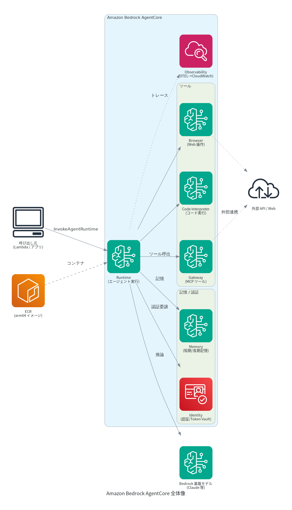
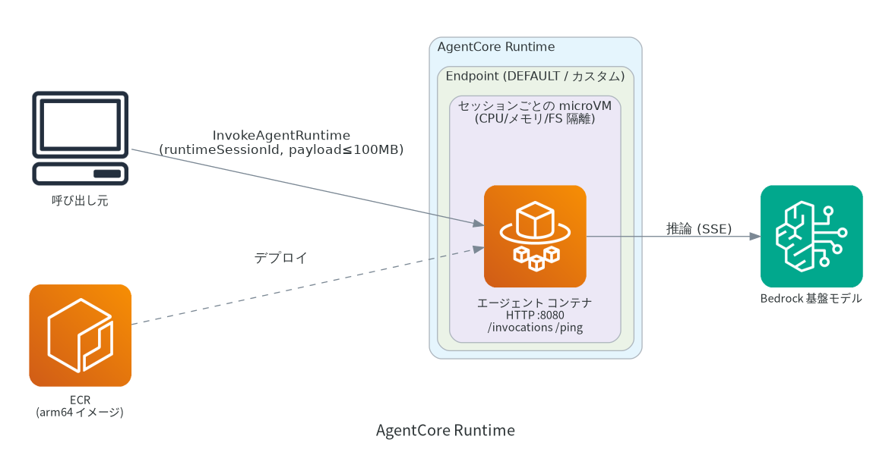
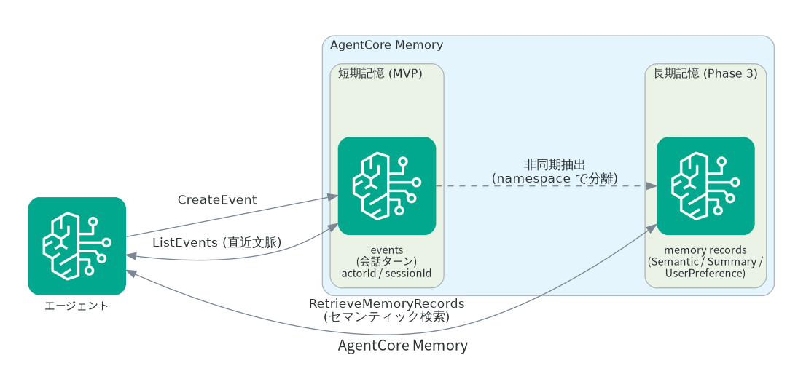
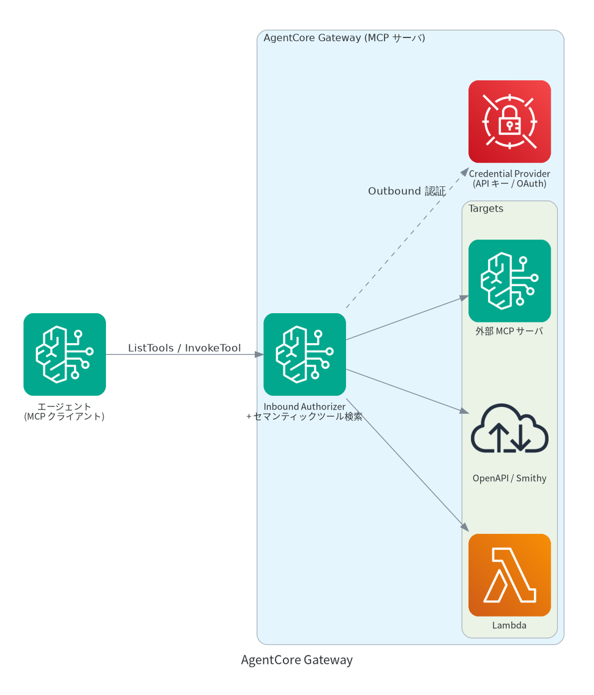
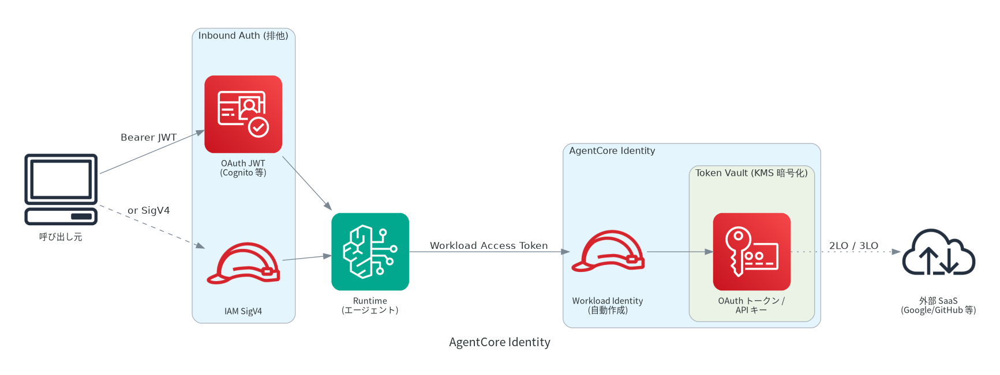
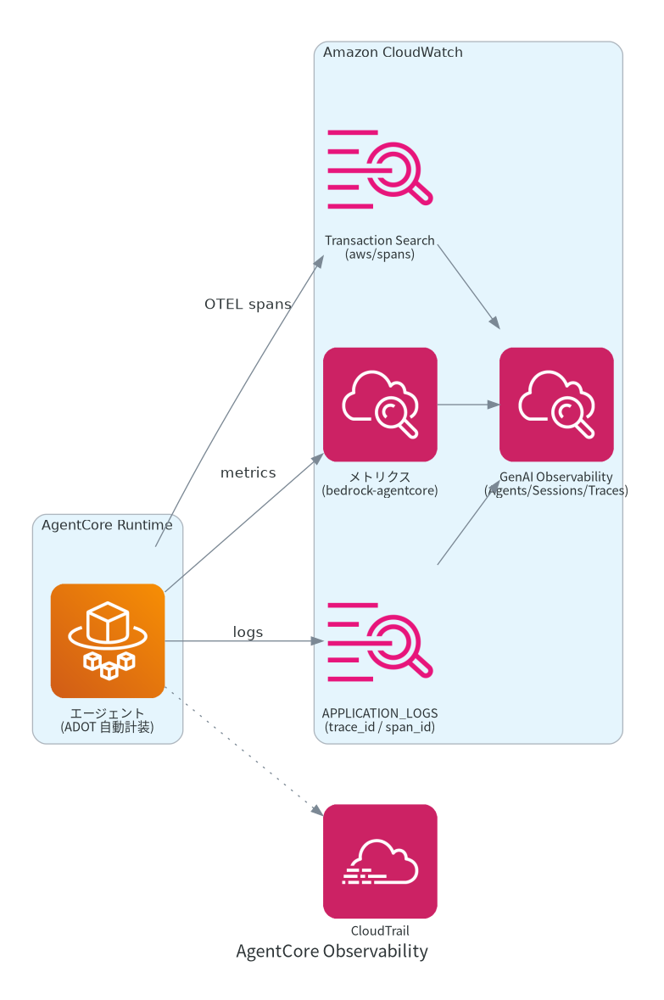

# 技術調査: Amazon Bedrock AgentCore

> **調査時点**: 2026-07 / **ステータス**: 調査スナップショット(一次情報は AWS 公式ドキュメント)
> 本プロダクトでの採用方針は [../specs/AGENTCORE_SPEC.md](../specs/AGENTCORE_SPEC.md) を参照。
> 本書は「AgentCore とは何か・各機能は何をするか」を理解するための調査資料です。

## 目次

- [概要](#概要)
- [前提情報(GA・リージョン・課金・言語対応)](#前提情報)
- [各機能の詳細](#各機能の詳細)
  - [1. Runtime](#1-runtime)
  - [2. Memory](#2-memory)
  - [3. Gateway](#3-gateway)
  - [4. Identity](#4-identity)
  - [5. Observability](#5-observability)
  - [6. Code Interpreter](#6-code-interpreter)
  - [7. Browser Tool](#7-browser-tool)
- [デプロイ / IaC / TypeScript 対応](#デプロイ--iac--typescript-対応)
- [参考リンク](#参考リンク)

## 概要

**Amazon Bedrock AgentCore** は、AI エージェントを本番運用するためのマネージドサービス群。
エージェントの「実行(Runtime)」「記憶(Memory)」「認証(Identity)」「ツール接続(Gateway)」
「監視(Observability)」「コード実行(Code Interpreter)」「Web 操作(Browser)」などを
個別に組み合わせて使える。**フレームワーク非依存・モデル非依存**(Strands / LangGraph /
CrewAI / LlamaIndex / **Mastra** / 自前コードなど、Bedrock 以外のモデルも可)。

エージェント本体は **Runtime** 上で動き、そこから記憶・ツール・認証・監視の各機能を呼び出す、
というハブ&スポーク構造で理解するとよい。

## 前提情報

| 項目 | 内容 |
| --- | --- |
| 提供状況 | **2025-10-13 に GA**(プレビューは 2025-07)。GA 時に VPC / PrivateLink / CloudFormation / タグ付けに対応 |
| リージョン | 東京(ap-northeast-1)を含む 9 リージョン(us-east-1/us-east-2/us-west-2/ap-south-1/ap-southeast-1/ap-southeast-2/ap-northeast-1/eu-central-1/eu-west-1) |
| 課金 | コンシューム(従量)課金。ハーネス自体は無料で、消費した基盤リソース分のみ課金 |
| API 面 | コントロールプレーン `bedrock-agentcore-control`(リソース CRUD)/ データプレーン `bedrock-agentcore`(実行・セッション・イベント) |
| 言語対応 | **Node.js/TypeScript がファーストクラス**(`bedrock-agentcore` npm、`@aws/agentcore` CLI)。Python も同等 |
| 構成機能 | Runtime / Memory / Gateway / Identity / Observability / Code Interpreter / Browser のほか、Policy / Evaluations / Web Search / Agent Registry 等 |

## 各機能の詳細

### 1. Runtime

エージェント/ツールをホストする**サーバーレス実行基盤**。スケーリング・セッション管理・
セキュリティ隔離をマネージドで提供する。

- **サービス契約**: コンテナが **port 8080** で `POST /invocations`(本体)と `GET /ping`(ヘルス)を提供。**linux/arm64 (Graviton) 必須**。MCP(:8000)や A2A(:9000)プロトコルも選択可。
- **セッション隔離**: セッションごとに専用 **microVM**(CPU/メモリ/FS を完全隔離、終了時にメモリサニタイズ)。状態はエフェメラル。
- **セッション寿命**: `runtimeSessionId`(UUID 推奨)で識別。アイドル 15 分 / 最大 8 時間で終了。
- **バージョン/エンドポイント**: 作成時に V1 + DEFAULT エンドポイント。設定変更ごとに**不変バージョン**が増え、エンドポイントの向け替えで**ゼロダウンタイム更新・即時ロールバック**(= Blue/Green)。
- **呼び出し**: `InvokeAgentRuntime`(payload 最大 100MB、SSE ストリーミング可)。
- **注意**: OAuth JWT インバウンドを使う場合、`InvokeAgentRuntime` は AWS SDK 経由で呼べず**生 HTTPS** が必要。

### 2. Memory

エージェント向けのマネージド記憶基盤。生の会話を保存し、非同期で「記憶レコード」を抽出する。

- **短期記憶**: 会話ターンを **event** として `CreateEvent` で保存し、`ListEvents` で取得。`actorId`(ユーザー)/ `sessionId`(会話)で整理。
- **長期記憶**: event から**非同期**で insight を抽出(**strategy**)。組み込み strategy は **Semantic**(事実)/ **UserPreference**(嗜好)/ **Summary**(セッション要約)/ Episodic。`RetrieveMemoryRecords`(**セマンティック検索**)で関連記憶を取得。
- **namespace**: 末尾スラッシュ付きの階層パス(`{actorId}`/`{sessionId}`/`{strategyId}` 変数)でマルチテナント分離。IAM の `bedrock-agentcore:namespace` 条件キーで制御可能。
- **課金(要再確認)**: 短期 $0.25/1,000 events、長期保存 $0.75/1,000 records・月、長期取得 $0.50/1,000 calls。

### 3. Gateway

既存 API/Lambda/OpenAPI/Smithy を**ゼロコードで MCP ツール化**するマネージド MCP サーバ(AI ゲートウェイ)。

- **ターゲット種別**: MCP ターゲット(集約モード・**セマンティックツール検索**・3LO 対応)/ HTTP ターゲット(直接プロキシ)/ Inference ターゲット(モデルルーティング)。
- **ツール変換**: Lambda を呼んで MCP でラップ、OpenAPI ↔ REST 自動変換、Smithy モデルから生成、外部 MCP サーバのツール発見。
- **Inbound(Gateway Authorizer)**: OAuth(JWT)/ IAM / authenticate-only / no-auth。
- **Outbound(Credential Provider)**: 実行ロール / API キー / OAuth(Token Vault 連携)。
- **課金(要再確認)**: ツール呼び出し $0.005/1,000、ツールインデックス $0.02/100 tools・月 など。

### 4. Identity

AI エージェント向けの認証・認可・資格情報管理。

- **Inbound Auth**(誰がエージェントを呼べるか): **IAM SigV4** か **OAuth JWT** の**排他選択**。JWT は `customJWTAuthorizer`(`discoveryUrl`/`allowedClients`/`allowedAudience`)で Cognito/Okta/Entra ID 等に対応。
- **Workload Identity**: エージェント固有の安定 ID。Runtime/Gateway デプロイ時に自動作成。
- **Outbound Auth / Token Vault**: 外部サービスの OAuth トークン・API キーを KMS 暗号化で保管。**2LO**(M2M)/ **3LO**(ユーザー同意)対応。Google/GitHub/Slack/Salesforce/Atlassian 等の組み込みプロバイダあり。
- **フロー**: Runtime が Inbound JWT を **Workload Access Token** に交換 → エージェントが `GetResourceOauth2Token` で外部トークン/3LO 認可 URL を取得。
- Runtime/Gateway 経由で使う場合は**追加課金なし**。

### 5. Observability

エージェントのトレース・デバッグ・監視。Amazon CloudWatch がバックエンド。

- **OTEL ネイティブ**。Runtime ホスト型は**自動計装**(Node.js は ADOT Node.js パッケージ)。追加コード不要。
- **前提設定(アカウント単位で一度)**: **CloudWatch Transaction Search を有効化**(spans を `aws/spans` に流す)。忘れるとトレースが見えない。
- **CloudWatch GenAI Observability** ダッシュボードで **Agents / Sessions / Traces** ビュー。session → trace → span の階層でエージェントの実行経路・中間出力を可視化。
- **メトリクス**(namespace `bedrock-agentcore`): Invocations / Throttles / Errors / Latency / SessionCount / ActiveSessionCount / トークン使用量など。
- ログには `trace_id` / `span_id` が付き、セッションを相関できる。

### 6. Code Interpreter

サンドボックスでの**安全なコード実行**環境(セッション隔離)。

- 言語: Python / JavaScript / **TypeScript**(主要ライブラリ同梱)。
- ファイル: インライン 100MB / S3 経由 5GB。実行時間: 既定 15 分〜最大 8 時間。インターネットアクセス・CloudTrail 記録あり。
- 用途: 計算・データ処理・CSV/Excel/JSON 処理をエージェントに安全に行わせる。

### 7. Browser Tool

マネージドな**Headless Chrome**(隔離・スケーラブル)。

- **Playwright / Strands / Amazon Nova Act** で操作。**Live View**(人間が介入)・**セッション録画**(S3 保存、リプレイ可)対応。
- セッションは既定 15 分 / 最大 8 時間。ephemeral。
- 用途: API のない Web 操作・フォーム入力・スクリーンショットによる視覚理解・human-in-the-loop。

## デプロイ / IaC / TypeScript 対応

- **デプロイ CLI**: **`@aws/agentcore`(npm、TypeScript ファースト)** が推奨。`create` / `add agent` / `dev`(ローカル hot-reload)/ `deploy`(CodeBuild で arm64 ビルド→ECR→Runtime)/ `invoke` / `status` / `logs` / `traces` / `evals`。旧 Python `bedrock-agentcore-starter-toolkit` は **legacy**。
- **エージェント実装(TS)**: `bedrock-agentcore` npm の **`BedrockAgentCoreApp`** で HTTP 契約(:8080)を満たす。**Mastra × AgentCore は公式デプロイガイドあり**(Mastra を `BedrockAgentCoreApp` でラップ、arm64 Dockerfile、非 root、ファイルストレージ無効化)。
- **IaC(要バージョン確認)**: CloudFormation に `AWS::BedrockAgentCore::*`(Runtime/Memory/Gateway/Identity/Browser/CodeInterpreter 等)が揃う。CDK は AWS 提供の construct があるが、**「安定版 L2」か「experimental な alpha」かは調査で情報が割れている**ため、採用前に対象バージョンの成熟度を確認し、本番は L1(`Cfn*`)も選択肢とする(→ Issue / ADR 化)。Terraform は `hashicorp/aws` / `awscc` / 公式モジュール `aws-ia/agentcore` で対応。

> **本プロダクトでの採用**: MVP は Runtime + Identity(Inbound)+ Memory(短期)+ Observability。
> Phase 2 で Gateway / Code Interpreter、Phase 3 で Memory(長期)/ Browser。
> 詳細は [../specs/AGENTCORE_SPEC.md](../specs/AGENTCORE_SPEC.md)。

## 参考リンク

- AgentCore 開発者ガイド: <https://docs.aws.amazon.com/bedrock-agentcore/latest/devguide/>
- Runtime サービス契約: <https://docs.aws.amazon.com/bedrock-agentcore/latest/devguide/runtime-service-contract.html>
- TypeScript CLI 入門: <https://docs.aws.amazon.com/bedrock-agentcore/latest/devguide/runtime-get-started-cli-typescript.html>
- Identity(Inbound/Outbound): <https://docs.aws.amazon.com/bedrock-agentcore/latest/devguide/runtime-oauth.html>
- Memory の構成: <https://docs.aws.amazon.com/bedrock-agentcore/latest/devguide/memory-organization.html>
- Gateway コアコンセプト: <https://docs.aws.amazon.com/bedrock-agentcore/latest/devguide/gateway-core-concepts.html>
- Observability: <https://docs.aws.amazon.com/bedrock-agentcore/latest/devguide/observability.html>
- 料金: <https://aws.amazon.com/bedrock/agentcore/pricing/>
- Mastra × AgentCore デプロイ: <https://mastra.ai/guides/deployment/aws-bedrock-agentcore>
- TypeScript SDK: <https://github.com/aws/bedrock-agentcore-sdk-typescript>

> 注: 料金・construct 成熟度・機能の GA 状況は変動が速い。実装着手時に一次情報で再確認すること。
