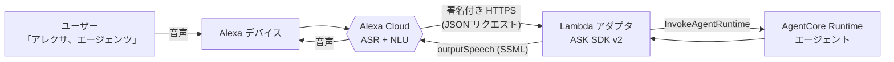
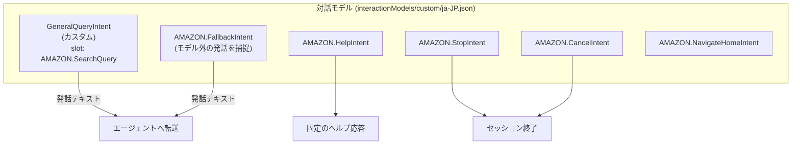
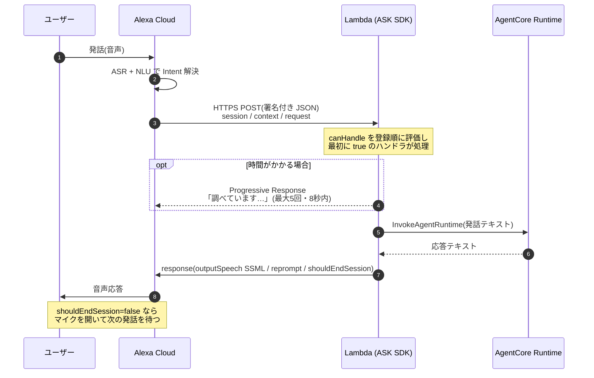
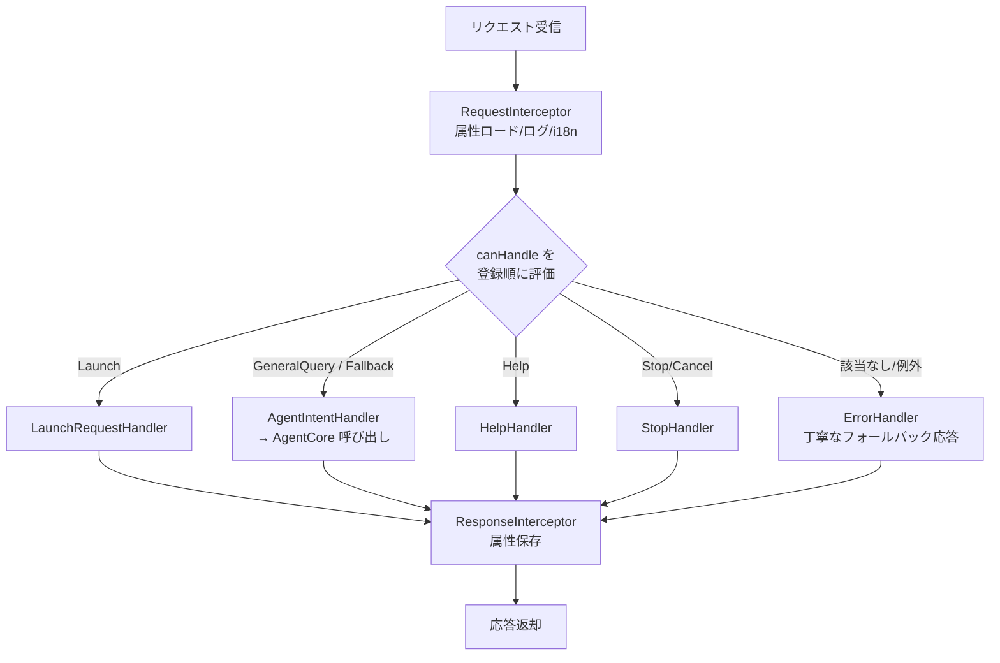

# 技術調査: Amazon Alexa カスタムスキル開発

> **調査時点**: 2026-07 / **ステータス**: 調査スナップショット(一次情報は Alexa 開発者ドキュメント)
> 本プロダクトでの対話設計は [../specs/API_SPEC.md](../specs/API_SPEC.md) を参照。
> 本書は「Alexa カスタムスキルをどう作るか」を、LLM エージェントをバックエンドに置く前提で
> まとめた調査資料です。図は Mermaid(GitHub 上でレンダリングされます)。

## 目次

- [全体像](#全体像)
- [スキルの構成要素](#スキルの構成要素)
- [リクエストのライフサイクル](#リクエストのライフサイクル)
- [ASK SDK v2 (Node.js/TypeScript)](#ask-sdk-v2-nodejstypescript)
- [音声出力とレイテンシ(8 秒の壁)](#音声出力とレイテンシ8-秒の壁)
- [状態管理(セッション/永続)](#状態管理セッション永続)
- [Account Linking](#account-linking)
- [ツールと開発ワークフロー](#ツールと開発ワークフロー)
- [認定と配布](#認定と配布)
- [LLM バックエンド特有の注意点](#llm-バックエンド特有の注意点)
- [参考リンク](#参考リンク)

## 全体像

Alexa は**音声認識(ASR)と音声合成(TTS)、自然言語理解(NLU)をクラウド側で担う**。
スキル開発者は「対話モデル(どんな発話をどの Intent に振るか)」と「エンドポイント
(Intent を受けて応答を返す処理)」を用意する。本プロダクトではエンドポイントを **Lambda**
とし、そこから **AgentCore Runtime** に発話を転送する。



## スキルの構成要素

### 呼び出し名(Invocation Name)

- 小文字の英字とスペースのみ(数字・記号は綴る)。`Alexa/Amazon/Echo/skill/app` や
  起動語(`ask/tell/open/start` 等)は使えない。
- 原則 2 語以上(造語なら 1 語可)。**認定・公開後は変更不可**。
- 本プロダクト: 「エージェンツ」。

### 対話モデル(Intent / Slot)



- **`AMAZON.SearchQuery`** が自由発話を捕捉する鍵。ただし制約が強い:
  - サンプル発話には**キャリアフレーズ(スロット外の語)が必須**(例: `{Query}について教えて`、`{Query}を検索して`)。**スロット単体の発話は不可**。
  - 1 Intent に **1 個まで**、**他スロットと併用不可**。
  - ja-JP 対応(キャリアフレーズは日本語: 「〜を検索して」「〜について教えて」など)。
- **`AMAZON.FallbackIntent`** でモデルに載らない発話も拾い、生テキストをエージェントへ渡す設計にすると、実質「なんでも話しかけられる」体験に近づく(完全な自由発話は SearchQuery の制約上むずかしいため Fallback で補完)。
- `Help/Stop/Cancel` は**認定必須**。

### スキルマニフェスト(skill.json)

- `publishingInformation`(名称・説明・アイコン・カテゴリ・配布国)、`apis.custom.endpoint`
  (Lambda ARN or HTTPS)、`permissions`、`privacyAndCompliance` を持つ。
- ASK CLI v2 プロジェクトの配布パッケージ: `skill-package/skill.json` +
  `skill-package/interactionModels/custom/ja-JP.json` + `lambda/`。

## リクエストのライフサイクル



- リクエスト種別: **LaunchRequest**(起動)/ **IntentRequest**(Intent 一致)/ **SessionEndedRequest**(終了。**応答不可**、クリーンアップ用)。
- `shouldEndSession`: `false`=継続、`true`=終了、省略=マイクは開かず継続。
- 開いたターンには **reprompt を必ず設定**(無いと無音でセッションが切れうる)。

## ASK SDK v2 (Node.js/TypeScript)

- 主要パッケージ: `ask-sdk-core`(ハンドラ/ResponseBuilder)、`ask-sdk-model`(型)、
  `ask-sdk`(+DynamoDB 永続化)、`ask-sdk-express-adapter`(自前 HTTPS 時の署名検証)。
- ハンドラは `{ canHandle, handle }`。**登録順**に `canHandle` を評価。



- **署名検証の担当**:
  - **ASK 提供の Lambda トリガー経由(推奨)**: 署名検証は不要。真正性は Lambda のリソースポリシー(プリンシパル `alexa-appkit.amazon.com` + `EventSourceToken` にスキル ID)で担保。
  - **自前 HTTPS エンドポイント**: `ask-sdk-express-adapter` で署名・タイムスタンプ検証を**自分で行う**。
- 多層防御として SDK の `.withSkillId('amzn1.ask.skill.xxxx')` も設定(自スキル以外の Intent を拒否)。
- 例外時は `ErrorHandler` で「少し時間がかかっています。もう一度お願いします」などを返す。

## 音声出力とレイテンシ(8 秒の壁)

**Alexa はスキル応答を約 8 秒しか待たない**。これが LLM バックエンドで最大の制約。

```mermaid
gantt
    title 1 ターンの 8 秒予算
    dateFormat X
    axisFormat %Ss
    section 応答予算(~8s)
    Progressive Response「調べています…」 :0, 1
    エージェント処理(LLM 推論)           :1, 6
    応答整形 + 返却                       :6, 7
    タイムアウト境界(~8s)               :milestone, 8, 0
```



- **Progressive Response API**: 処理中に「調べています…」等のつなぎ音声を再生し、体感待ち時間を短縮。**最大 5 回**だが**8 秒は延長されない**。
- **ストリーミング不可**: Alexa は 1 ターンにつき確定した `outputSpeech` を 1 つだけ話す。エージェント応答は**バッファして丸ごと**返す。
- **SSML**: `<speak>` 内で `break`/`emphasis`/`prosody`/`say-as`/`audio`(MP3, HTTPS, ≤240s)等が使える。
- **文字数上限**: `outputSpeech` は **8,000 文字未満**。LLM 応答は音声向けに短く要約。
- 対策: 応答を短く生成、軽量モデル(レイテンシ重視)、コールドスタート抑制(バンドル最小化・必要なら Provisioned Concurrency)。長時間タスクは同一ターンで返せないため「受領→後続ターンで通知」等の非同期設計にする。

## 状態管理(セッション/永続)

| 種別 | API | 生存期間 | 用途 |
| --- | --- | --- | --- |
| セッション属性 | `attributesManager.getSessionAttributes()` | セッション内のみ(応答 JSON で往復) | 会話スレッド ID・直近文脈 |
| 永続属性 | `getPersistentAttributes()` / `savePersistentAttributes()` | セッションを跨ぐ(要アダプタ) | ユーザーの長期状態 |
| リクエスト属性 | `getRequestAttributes()` | 単一リクエスト内 | i18n 文字列など |

- 永続化アダプタは **DynamoDB を推奨**(read-after-write 整合)。S3 は結果整合。
- マルチターンの会話文脈は本プロダクトでは AgentCore(Runtime セッション + Memory)側で保持し、Alexa 側はスレッド ID 程度に留める。

## Account Linking

- OAuth 2.0。**Authorization Code Grant(PKCE)推奨**。リンク後は `context.System.user.accessToken` に
  トークンが入る(`Alexa.getAccountLinkingAccessToken()`)。未リンク時は **LinkAccount カード**で誘導。
- 必要になるのは、エージェントが**特定エンドユーザーとして**振る舞う/ユーザー固有データを扱うとき
  (本プロダクトでは Phase 3。詳細は [../specs/AUTH_SPEC.md](../specs/AUTH_SPEC.md))。

## ツールと開発ワークフロー

- **ASK CLI v2**: `ask new`(雛形)/ `ask deploy`(スキルパッケージ + Lambda)/ `ask dialog`(端末でマルチターン模擬)。
  ※ v1 の高レベル `ask simulate` は**廃止**。低レベルの `ask smapi simulate-skill` + `get-skill-simulation` を使う。
- **CDK の注意(重要)**: 当初 spec で挙げた **`@alexa/ask-cdk` は事実上メンテ停止(0.0.2, 約4年前)**。実用候補は
  ① AWS 側(Lambda/IAM/DynamoDB)を通常の CDK、スキルパッケージ/モデルを **ASK CLI (`ask deploy`)** で管理、
  ② L1 の `Alexa::ASK::Skill`(`@aws-cdk/alexa-ask` / `CfnSkill`)、
  ③ `cdk-alexa-skill`(aws-samples、要 CDK v2 互換確認)。
  → どれを採るかは [Issue](https://github.com/y-ohgi/alexa-agent/issues) で決定する。
- **ローカルテスト**: Alexa Developer Console のシミュレータ(ja-JP でテスト可)、ASK Toolkit for VS Code、`ask dialog`。
- **ユニットテスト**: `ask-sdk-test`(taimos 製のコミュニティパッケージ。ASK SDK v2 対応。Amazon 公式ではない点に注意)。
- **Lambda トリガー権限**(同一アカウント):

  ```bash
  aws lambda add-permission --function-name my-skill \
    --statement-id alexa-skill-trigger --action lambda:InvokeFunction \
    --principal alexa-appkit.amazon.com \
    --event-source-token amzn1.ask.skill.<SKILL_ID>
  ```

## 認定と配布

- 認定は **Policy / Security / Functional / VUI(UX)** の 4 観点。Help/Stop/Cancel 実装、想定外入力の
  グレースフルな処理、reprompt、(個人情報を扱うなら)プライバシーポリシー URL などが必須。
- 配布モード:
  - **Public**(ストア公開、要フル認定)
  - **Beta Test**(招待制、最大 ~500 名。フル公開前の内部パイロットに最適)
  - **Private / Alexa for Business**(組織向け)
  - **自分の開発アカウント内テストのみなら認定不要**(最短の開発経路)。

## LLM バックエンド特有の注意点

1. **8 秒 vs LLM レイテンシ**(最大の課題)。Progressive Response + 短い応答 + 軽量モデル + 非同期設計で対処。
2. **Alexa へのストリーミング不可**。確定応答を丸ごと返す。
3. **`AMAZON.SearchQuery` の自由発話制約**(キャリアフレーズ必須・1 個・併用不可)→ Fallback で補完。
4. **8,000 文字上限** → 要約。
5. **ja-JP 固有**: SearchQuery/Fallback は ja-JP 対応。キャリアフレーズは日本語。ja-JP ロケールでビルド・テスト。
6. **SessionEndedRequest では応答不可**(クリーンアップのみ)。
7. **reprompt 必須**(開いたターン)。
8. **スキル ID 検証**は EventSourceToken と `.withSkillId()` の両方で。
9. **永続化は DynamoDB 推奨**。
10. **コールドスタート**が 8 秒予算を圧迫 → バンドル最小化・必要なら暖機。

> 補足: Alexa Conversations / ACDL は近年 de-emphasize 傾向のため、新規 LLM スキルでは
> **クラシックな Intent + `AMAZON.SearchQuery` + Fallback** の構成が安全。

## 参考リンク

- スロット型 / SearchQuery: <https://developer.amazon.com/en-US/docs/alexa/custom-skills/slot-type-reference.html>
- 呼び出し名: <https://developer.amazon.com/en-US/docs/alexa/custom-skills/choose-the-invocation-name-for-a-custom-skill.html>
- リクエスト種別: <https://developer.amazon.com/en-US/docs/alexa/custom-skills/request-types-reference.html>
- リクエスト/レスポンス JSON: <https://developer.amazon.com/en-US/docs/alexa/custom-skills/request-and-response-json-reference.html>
- Node SDK(ハンドラ): <https://developer.amazon.com/en-US/docs/alexa/alexa-skills-kit-sdk-for-nodejs/handle-requests.html>
- Progressive Response: <https://developer.amazon.com/en-US/docs/alexa/custom-skills/send-the-user-a-progressive-response.html>
- SSML: <https://developer.amazon.com/en-US/docs/alexa/custom-skills/speech-synthesis-markup-language-ssml-reference.html>
- Account Linking: <https://developer.amazon.com/en-US/docs/alexa/account-linking/account-linking-concepts.html>
- Lambda ホスティング(トリガー権限): <https://developer.amazon.com/en-US/docs/alexa/custom-skills/host-a-custom-skill-as-an-aws-lambda-function.html>
- ASK CLI コマンド: <https://developer.amazon.com/en-US/docs/alexa/smapi/ask-cli-command-reference.html>
- 認定要件: <https://developer.amazon.com/en-US/docs/alexa/custom-skills/certification-requirements-for-custom-skills.html>
- Node SDK リポジトリ: <https://github.com/alexa/alexa-skills-kit-sdk-for-nodejs>
- ja-JP スロット型: <https://developer.amazon.com/ja-JP/docs/alexa/custom-skills/ja-slot-type-reference.html>

> 注: 数値上限・CDK 周辺パッケージの保守状況は変動しうる。実装着手時に一次情報で再確認すること。
