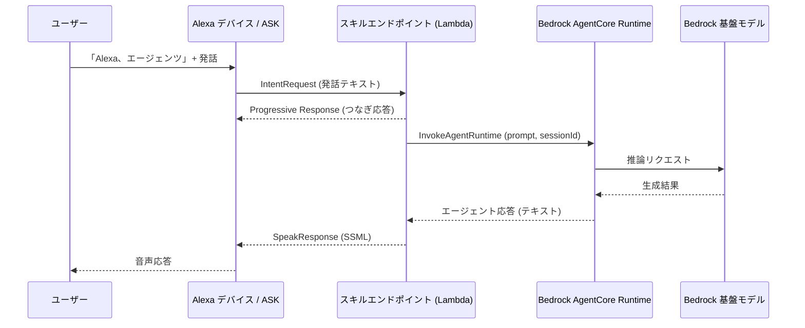

# システム構成仕様 (ARCHITECTURE_SPEC)

| 項目 | 内容 |
| --- | --- |
| ステータス | Draft |
| 最終更新日 | 2026-07-13 |
| 関連仕様 | [OVERVIEW_SPEC.md](./OVERVIEW_SPEC.md), [API_SPEC.md](./API_SPEC.md) |

## 概要

`alexa-agent` の MVP(ミニマル実装)におけるシステム構成、各コンポーネントの責務、
および設計上の重要な制約を定義する。

## 背景・目的

- Alexa スキルの応答タイムアウトという強い制約の中で、LLM エージェントの応答を
  成立させる構成を最初に固めておく必要がある
- ミニマルに始めつつ、将来のツール実行・記憶(AgentCore Memory / Gateway)へ
  自然に拡張できる構成にする

## 仕様(確定事項)

### 全体構成(MVP)

### コンポーネント責務

| コンポーネント | 責務 |
| --- | --- |
| Alexa Skills Kit (対話モデル) | ウェイクコマンド「エージェンツ」での起動、発話のテキスト化、Intent へのルーティング |
| スキルエンドポイント (Lambda) | Alexa リクエストの受付・署名検証(ASK SDK)、発話テキストの抽出、AgentCore 呼び出し、応答の SSML 整形、タイムアウト/エラーハンドリング |
| AgentCore Runtime | エージェントロジックの実行。システムプロンプト管理、Bedrock 基盤モデルの呼び出し、セッション単位の会話文脈の維持 |
| Bedrock 基盤モデル | 応答テキストの生成 |

MVP ではエージェントロジックを AgentCore Runtime に置き、Lambda は「Alexa と AgentCore の
アダプタ」に徹する。エージェントの能力拡張(ツール・記憶)は Lambda に手を入れず
AgentCore 側で完結させる。

### 将来拡張の位置付け(MVP では実装しない)

| コンポーネント | フェーズ | 役割 |
| --- | --- | --- |
| AgentCore Gateway | Phase 2 | 外部 API をツールとしてエージェントに公開する |
| AgentCore Memory | Phase 3 | セッションを跨ぐ長期記憶・パーソナライズ |

### 設計制約: Alexa 応答タイムアウトと LLM レイテンシ

**Alexa スキルはリクエスト受信から約 8 秒以内に応答を返す必要がある**。LLM の生成レイテンシ
はこれに収まらない可能性があるため、以下を前提とする。

- **Progressive Response API** を使い、AgentCore 呼び出し前に「考えています」等の
  つなぎ音声を返してユーザー体験の空白を埋める(タイムアウト自体は延長されない点に注意)
- Alexa の応答はストリーミングできないため、エージェント応答は**完成テキストを一括で返す**
- Lambda 側でデッドライン(例: 7 秒)を設け、超過時は「もう一度言ってください」等の
  フォールバック応答を返してセッションを維持する
- エージェント側の応答は音声向けに**短く生成する**(システムプロンプトで制御)。
  これはレイテンシ対策と音声 UX の両方に効く

### セッション設計

| Alexa 側 | AgentCore 側 | マッピング方針 |
| --- | --- | --- |
| `session.sessionId` | `runtimeSessionId` | Alexa のセッション ID から AgentCore のセッション ID を導出し、スキルセッション中は同一セッションとして会話文脈を維持する |
| `session.user.userId` | (Phase 3: Memory の actorId) | MVP では未使用。長期記憶導入時にユーザー識別子として使う |

- MVP の会話文脈は AgentCore Runtime のセッション内で維持し、Lambda は状態を持たない
- Alexa セッションが終了(Stop/タイムアウト)したら文脈も破棄されてよい

## 未確定事項 (Open Questions)

- [ ] 使用する基盤モデル(例: Claude 系のどのモデルか。レイテンシ重視なら軽量モデルという選択肢)
- [ ] AWS リージョン(AgentCore 対応リージョンと Alexa エンドポイントの近接性)
- [ ] AgentCore Runtime 上のエージェント実装フレームワーク(Strands Agents / LangGraph / 自前 等)
- [ ] IaC: CDK / Terraform / SAM のどれで管理するか(ASK 側は ask-cli を使うか)
- [ ] Lambda のランタイム言語(Python / TypeScript)
- [ ] Account Linking の要否(MVP では不要の想定で良いか)
- [ ] 監視・ログ方針(CloudWatch / AgentCore Observability)

## 変更履歴

| 日付 | 変更内容 |
| --- | --- |
| 2026-07-13 | 初版作成 |
