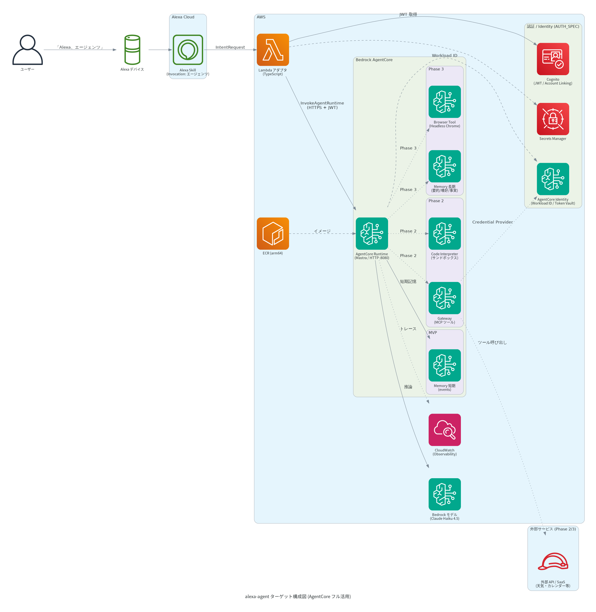
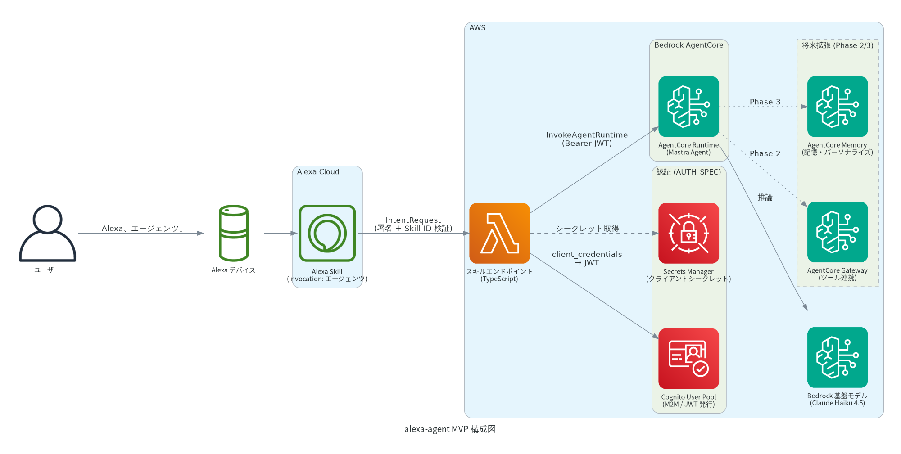
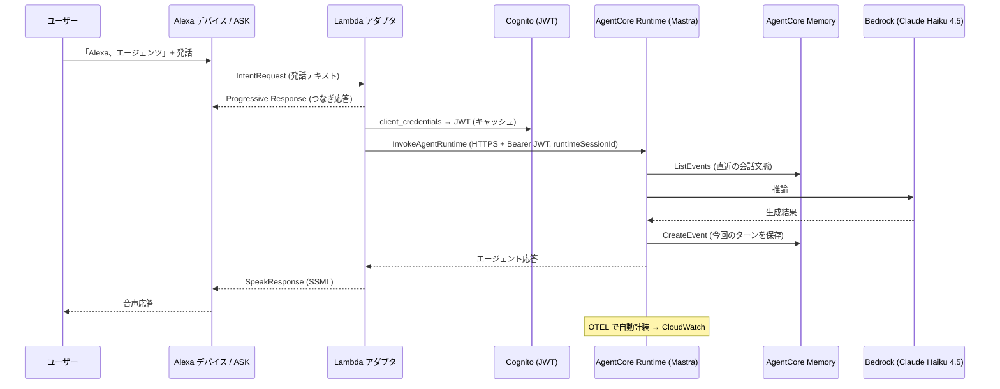

# システム構成仕様 (ARCHITECTURE_SPEC)

| 項目 | 内容 |
| --- | --- |
| ステータス | Draft |
| 最終更新日 | 2026-07-13 |
| 関連仕様 | [OVERVIEW_SPEC.md](./OVERVIEW_SPEC.md), [AGENTCORE_SPEC.md](./AGENTCORE_SPEC.md), [API_SPEC.md](./API_SPEC.md), [AUTH_SPEC.md](./AUTH_SPEC.md), [CICD_SPEC.md](./CICD_SPEC.md) |

## 概要

`alexa-agent` のシステム構成、各コンポーネントの責務、設計制約を定義する。
Amazon Bedrock AgentCore を基盤とし、その各機能を段階的にフル活用する
([AGENTCORE_SPEC.md](./AGENTCORE_SPEC.md))。本書は構成の全体像に責務を持ち、
機能詳細・認証・CI/CD は関連仕様書に委ねる。

## 背景・目的

- Alexa の応答タイムアウトという制約の中で、AgentCore Runtime 上のエージェント応答を成立させる
- AgentCore の Runtime / Identity / Memory / Observability を MVP から使い、
  Gateway / Code Interpreter / Browser へ自然に拡張できる構成にする

## 仕様(確定事項)

### 技術スタック

| 項目 | 選定 | 備考 |
| --- | --- | --- |
| 基盤モデル | **Claude Haiku 4.5**(Bedrock) | 安価・低レイテンシ・日本語会話品質のバランス。フォールバック候補は Nova 系(Open Question) |
| エージェントフレームワーク | **Mastra**(TypeScript) | `bedrock-agentcore` の `BedrockAgentCoreApp` でラップしコンテナ化 |
| 実行基盤 | **AgentCore Runtime** | コンテナ(arm64)を ECR 経由でデプロイ |
| 実装言語 | **TypeScript** | Lambda / エージェント共通 |
| IaC | **AWS CDK (TypeScript)** | `aws-cdk-lib/aws-bedrockagentcore`(安定版 L2)を使用 |
| デプロイ CLI | **`@aws/agentcore`**(npm) | ローカル開発(`agentcore dev`)と補助。※旧 Python `bedrock-agentcore-starter-toolkit` は legacy のため不採用 |
| 認証基盤 | **Amazon Cognito + AgentCore Identity** | 詳細は [AUTH_SPEC.md](./AUTH_SPEC.md) |
| 監視 | **AgentCore Observability(CloudWatch GenAI Observability)** | OTEL 自動計装 |
| CI/CD | **GitHub Actions + OIDC** | 詳細は [CICD_SPEC.md](./CICD_SPEC.md) |

### 全体構成(ターゲットアーキテクチャ)

AgentCore のフル活用を見据えたターゲット構成。フェーズ別採用は [AGENTCORE_SPEC.md](./AGENTCORE_SPEC.md) を参照。

### 全体構成(MVP)と処理フロー

MVP は Runtime / Identity(Inbound)/ Memory(短期)/ Observability を使用する。

### コンポーネント責務

| コンポーネント | 責務 |
| --- | --- |
| Alexa Skills Kit(対話モデル) | ウェイクコマンド「エージェンツ」での起動、発話のテキスト化、Intent ルーティング |
| Lambda アダプタ(TypeScript) | Alexa リクエストの受付・署名/Skill ID 検証、JWT 取得(キャッシュ)、`InvokeAgentRuntime` の HTTPS 呼び出し、SSML 整形、タイムアウト/エラーハンドリング。ステートレス |
| Cognito User Pool | Lambda→Runtime 用 JWT(M2M)発行([AUTH_SPEC.md](./AUTH_SPEC.md)) |
| Secrets Manager | Cognito クライアントシークレット保管 |
| ECR | エージェントコンテナイメージ(arm64)の格納 |
| AgentCore Runtime(Mastra) | エージェントロジック実行。8080 で `/invocations`・`/ping` を提供。Bedrock 呼び出し、Memory 読み書き、セッション文脈維持 |
| AgentCore Memory | 短期記憶(会話 event)。Phase 3 で長期記憶(要約・嗜好・事実) |
| AgentCore Identity | Workload Identity、Inbound JWT 検証、Phase 2 で Outbound(Token Vault) |
| AgentCore Observability | OTEL 自動計装 → CloudWatch(トレース/メトリクス/ログ) |
| Bedrock 基盤モデル(Claude Haiku 4.5) | 応答テキスト生成 |

### 後続フェーズの拡張(位置付けのみ)

| コンポーネント | フェーズ | 役割 |
| --- | --- | --- |
| AgentCore Gateway | Phase 2 | 外部 API/Lambda を MCP ツール化してエージェントに公開 |
| AgentCore Code Interpreter | Phase 2 | サンドボックスでのコード実行(計算・データ処理) |
| AgentCore Memory(長期) | Phase 3 | セッションを跨ぐ記憶・パーソナライズ |
| AgentCore Browser Tool | Phase 3 | マネージド Headless Chrome によるウェブ操作 |

### 設計制約: Alexa 応答タイムアウトと LLM レイテンシ

**Alexa スキルはリクエスト受信から約 8 秒以内に応答を返す必要がある**。

- **Progressive Response API** で AgentCore 呼び出し前につなぎ音声を返す(タイムアウト自体は延長されない)。
- Alexa 応答はストリーミング不可のため、エージェント応答は**完成テキストを一括**で返す。
  (AgentCore Runtime 内部の SSE ストリーミングは活用しつつ、Lambda で集約する)
- Lambda 側にデッドライン(例: 7 秒)を設け、超過時はフォールバック応答でセッション維持。
- エージェント応答は音声向けに**短く生成**(システムプロンプトで制御)。レイテンシと音声 UX の両対策。
- **JWT インバウンド採用の帰結**: `InvokeAgentRuntime` は AWS SDK 経由で呼べず**生 HTTPS** で叩く。Lambda に軽量 HTTP クライアント実装が必要([AUTH_SPEC.md](./AUTH_SPEC.md))。

### セッション設計

| Alexa 側 | AgentCore 側 | マッピング方針 |
| --- | --- | --- |
| `session.sessionId` | `runtimeSessionId` / Memory `sessionId` | Alexa セッション ID から決定的に導出(UUID 化)。スキルセッション中は同一で文脈維持 |
| `session.user.userId` | Memory `actorId` | MVP: 短期記憶の actor 識別に使用。Phase 3: Account Linking 済みユーザー ID に置換 |

- MVP の会話文脈は Runtime セッション + Memory 短期記憶で維持。Lambda は状態を持たない。
- Runtime セッションはアイドル 15 分/最大 8 時間で終了。Alexa セッション終了時は文脈破棄で問題ない。

### 構成図の運用

- 構成図は diagram-as-code([mingrammer/diagrams](https://diagrams.mingrammer.com/))で管理する。
  - 定義: [`docs/diagrams/architecture.py`](../diagrams/architecture.py)(MVP)/ [`docs/diagrams/architecture_target.py`](../diagrams/architecture_target.py)(ターゲット)
  - 生成物: `docs/specs/assets/architecture.png` / `architecture_target.png`
  - 生成手順は [`docs/diagrams/README.md`](../diagrams/README.md)、CI での検証は [CICD_SPEC.md](./CICD_SPEC.md) を参照
- **構成を変更する PR では、同一 PR 内で図を再生成してコミットする**(ニアリアルタイム=デプロイ単位で実構成に追従)。
- CI に diagram ジョブを設け、図生成コードが壊れていないことを検証する。将来は CDK デプロイの CI で自動再生成・自動コミットに移行する。

## 未確定事項 (Open Questions)

- [ ] AWS リージョン(第一候補: ap-northeast-1。AgentCore 提供済み・Bedrock モデル可用性を確認)
- [ ] Runtime デプロイの主軸を CDK(`aws-bedrockagentcore` L2 コンテナ artifact)にするか `@aws/agentcore` CLI にするか
- [ ] MVP で AgentCore Memory を使うか、Runtime セッション内文脈のみで足りるか(コスト/学習価値)
- [ ] ASK 側リソース(対話モデル・マニフェスト)の管理を `@alexa/ask-cdk` に寄せるか `ask-cli` にするか([CICD_SPEC.md](./CICD_SPEC.md))
- [ ] 監視のアラート設計(CloudWatch アラーム閾値、エラー率/レイテンシ)

## 変更履歴

| 日付 | 変更内容 |
| --- | --- |
| 2026-07-13 | 初版作成 |
| 2026-07-13 | 技術スタック確定(Claude Haiku 4.5 / Mastra / TypeScript / CDK)、AWS アイコン構成図と運用ルールを追加、認証を AUTH_SPEC に分離 |
| 2026-07-13 | AgentCore フル活用構成に再設計。Runtime コンテナ契約・Memory・Identity・Observability を反映、ECR/CDK L2/`@aws/agentcore` を追記、ターゲット構成図を追加、CICD_SPEC/AGENTCORE_SPEC と接続 |
