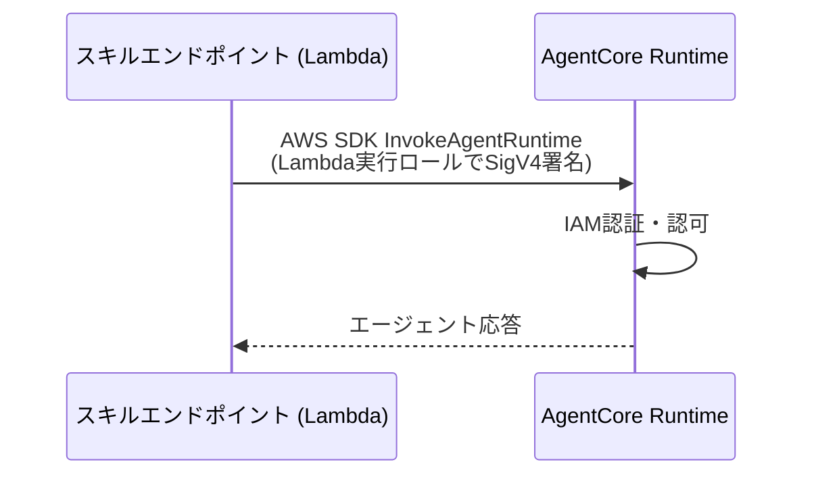

# 認証認可仕様 (AUTH_SPEC)

| 項目 | 内容 |
| --- | --- |
| ステータス | Draft |
| 最終更新日 | 2026-07-14 |
| 関連仕様 | [ARCHITECTURE_SPEC.md](./ARCHITECTURE_SPEC.md), [AGENTCORE_SPEC.md](./AGENTCORE_SPEC.md), [API_SPEC.md](./API_SPEC.md) |

## 概要

`alexa-agent` の各コンポーネント境界における認証・認可の仕組みを定義する。
MVPのAgentCore Runtime Inbound AuthはIAM SigV4、外部サービス連携はAgentCore Identity、
Phase 3のAccount LinkingはCognito/OAuthとし、境界ごとに適切な認証方式を採用する。

## 背景・目的

- AgentCore Runtime のエンドポイントを保護し、正当なスキルエンドポイント(Lambda)
  以外から呼び出せないようにする
- 将来のAlexa Account Linkingと外部ツール連携はMVPのservice-to-service認証から分離し、
  必要になる時点でユーザー委任の境界を追加する

## 仕様(確定事項)

### 認証境界の全体像

| # | 境界 | 方式 | フェーズ |
| --- | --- | --- | --- |
| 1 | Alexa Platform → Lambda | ASK リクエスト署名検証 + Skill ID 検証 | MVP |
| 2 | Lambda → AgentCore Runtime (Inbound Auth) | IAM SigV4(Lambda 実行ロール) | MVP |
| 3 | AgentCore → 外部ツール (Outbound Auth) | AgentCore Identity(OAuth 2LO/3LO・API キー管理) | Phase 2 |
| 4 | エンドユーザー識別(Account Linking) | Alexa Account Linking + Cognito | Phase 3 |

### 1. Alexa Platform → Lambda

- ASK SDK(`ask-sdk-core`)標準のリクエスト検証を使用する
  - リクエスト署名の検証(Alexa からのリクエストであることの確認)
  - タイムスタンプ検証
- **Skill ID 検証**を必ず有効化し、自スキル以外からの呼び出しを拒否する
- Lambda 関数は Alexa トリガー(Skill ID 条件付きのリソースベースポリシー)以外から
  Invoke できないよう IAM で制限する

### 2. Lambda → AgentCore Runtime(Inbound Auth)

AgentCore の **Inbound Auth** は「**IAM SigV4**」と「**OAuth JWT**」の**排他選択**
(同一 Runtime バージョンで両方は使えない)。MVP はAWS内のservice-to-service通信なので、
[ADR-0002](../adr/0002-runtime-inbound-auth.md)に従い **IAM SigV4** を採用する。

#### 呼び出しフロー

- Lambda 実行ロールには対象Runtime ARNに限定した
  `bedrock-agentcore:InvokeAgentRuntime` のみを許可する
- SDK clientはハンドラ外で再利用し、接続確立のオーバーヘッドを減らす
- RuntimeをJWTへ移行する場合は別versionまたはGatewayを用い、IAMとの同時利用を前提にしない

#### Workload Identity

- AgentCore Runtime をデプロイすると **Workload Identity**(エージェント固有の安定した ID)が
  自動作成される。エージェント ↔ ユーザー ↔ 外部トークンの束ね(Token Vault のキー)に使われる。
- 中央の「agent identity directory」でガバナンスされる(Cognito の user pool に相当する概念)。

### 3. AgentCore → 外部ツール(Outbound Auth / Phase 2)

外部 API をツールとして呼び出す際の認証情報管理には **AgentCore Identity + Token Vault** を使用する。

- **Token Vault**: 外部サービスの OAuth トークン・OAuth クライアント資格情報・API キーを
  KMS 暗号化で保管。Workload Identity + ユーザー ID にトークンをバインドし、
  期限切れまで再同意を不要にする(ゼロトラスト検証)。
- **モード**: user-delegated(エンドユーザー代理)/ autonomous(サービスレベル)。
  **2LO**(client_credentials)/ **3LO**(認可コード・ユーザー同意)/ API キーに対応。
  Google/GitHub/Slack/Salesforce/Atlassian 等の組み込みプロバイダあり。
- **取得フロー**: Runtime が Inbound JWT を **Workload Access Token** に交換してエージェントに渡し、
  エージェントは `GetResourceOauth2Token`(Token Vault)で外部トークン/3LO 認可 URL を得る。
- Gateway 経由のツールでは Gateway の Credential Provider がこれを担う([AGENTCORE_SPEC.md](./AGENTCORE_SPEC.md))。
- 詳細は Phase 2 のツール仕様(`TOOLS_SPEC.md` 予定)策定時に具体化する。

### 4. エンドユーザー識別(Phase 3 構想)

記憶・パーソナライズ(AgentCore Memory)導入時にエンドユーザー単位の認可が必要になる。

- **Alexa Account Linking** を Cognito User Pool(Authorization Code グラント)と接続する
- Alexa リクエストに含まれる `accessToken` を検証し、Cognito 上のユーザーと紐付ける
- 紐付けたユーザー ID を AgentCore Memory の `actorId` として使用する
- Memory の **namespace**(`{actorId}` 変数を含む階層パス)をユーザー単位に切り、
  IAM の `bedrock-agentcore:namespace` / `bedrock-agentcore:namespacePath` 条件キーで
  他ユーザーの記憶へアクセスできないよう制御する([AGENTCORE_SPEC.md](./AGENTCORE_SPEC.md))

## 未確定事項 (Open Questions)

- [ ] Phase 3でRuntime認証もJWTへ移行するか、Gatewayまたは上流でユーザー認可を完結するか
- [ ] Account Linking の必須/任意(Phase 3 で、未リンクユーザーにも自由対話を許すか)

## 変更履歴

| 日付 | 変更内容 |
| --- | --- |
| 2026-07-13 | 初版作成 |
| 2026-07-13 | AgentCore Identity 準拠に更新。Inbound の SigV4/JWT 排他と JWT 時の生 HTTPS 制約、Workload Identity、Token Vault(Outbound)、Memory namespace の IAM 制御を追記 |
| 2026-07-14 | ADR-0002に基づきMVPのInbound認証をIAM SigV4へ確定。Cognito M2MをMVPから除外 |
