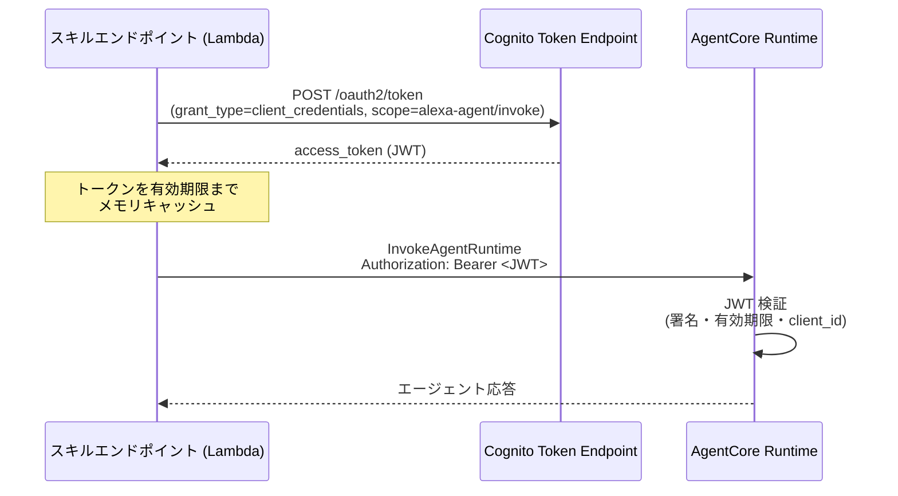

# 認証認可仕様 (AUTH_SPEC)

| 項目 | 内容 |
| --- | --- |
| ステータス | Draft |
| 最終更新日 | 2026-07-13 |
| 関連仕様 | [ARCHITECTURE_SPEC.md](./ARCHITECTURE_SPEC.md), [AGENTCORE_SPEC.md](./AGENTCORE_SPEC.md), [API_SPEC.md](./API_SPEC.md) |

## 概要

`alexa-agent` の各コンポーネント境界における認証・認可の仕組みを定義する。
AgentCore が提供する認証機構(Inbound Auth の JWT オーソライザ、Outbound Auth の
AgentCore Identity)を採用し、**MVP から JWT/OAuth ベースの構成**で実装する。

## 背景・目的

- AgentCore Runtime のエンドポイントを保護し、正当なスキルエンドポイント(Lambda)
  以外から呼び出せないようにする
- 将来の Alexa Account Linking(エンドユーザー単位の認可)や外部ツール連携
  (Outbound OAuth)へ、認証基盤を作り直さずに拡張できる土台を MVP 時点で敷く

## 仕様(確定事項)

### 認証境界の全体像

| # | 境界 | 方式 | フェーズ |
| --- | --- | --- | --- |
| 1 | Alexa Platform → Lambda | ASK リクエスト署名検証 + Skill ID 検証 | MVP |
| 2 | Lambda → AgentCore Runtime (Inbound Auth) | OAuth 2.0 `client_credentials` + JWT ベアラートークン(IdP: Amazon Cognito) | MVP |
| 3 | AgentCore → 外部ツール (Outbound Auth) | AgentCore Identity(OAuth 2LO/3LO・API キー管理) | Phase 2 |
| 4 | エンドユーザー識別(Account Linking) | Alexa Account Linking + Cognito | Phase 3 |

### 1. Alexa Platform → Lambda

- ASK SDK(`ask-sdk-core`)標準のリクエスト検証を使用する
  - リクエスト署名の検証(Alexa からのリクエストであることの確認)
  - タイムスタンプ検証
- **Skill ID 検証**を必ず有効化し、自スキル以外からの呼び出しを拒否する
- Lambda 関数は Alexa トリガー(Skill ID 条件付きのリソースベースポリシー)以外から
  Invoke できないよう IAM で制限する

### 2. Lambda → AgentCore Runtime(Inbound Auth)

AgentCore の **Inbound Auth** は「**IAM SigV4**」と「**OAuth JWT**」の**排他選択**
(同一 Runtime バージョンで両方は使えない)。本プロダクトは Account Linking(Phase 3)への
拡張性を重視し、**Cognito の JWT オーソライザ(`customJWTAuthorizer`)** を採用する。
IdP は **Amazon Cognito User Pool**、MVP は M2M(machine-to-machine)構成とする。

> **重要な制約(実装に直結)**: OAuth JWT インバウンドを使う場合、`InvokeAgentRuntime` を
> **AWS SDK 経由では呼べず、生の HTTPS リクエスト**(`Authorization: Bearer <JWT>`)で
> エンドポイントを叩く必要がある。Lambda アダプタに軽量 HTTP クライアント実装が必要。
> IAM SigV4 を選べば AWS SDK で呼べて簡素になる代わり、エンドユーザー認可への発展が弱い。
> このトレードオフは Open Questions で MVP 実装前に最終判断する。

#### Cognito 側の構成

| リソース | 設定 |
| --- | --- |
| User Pool | 認証基盤(MVP ではユーザーは登録しない。M2M 専用) |
| Resource Server | identifier: `alexa-agent`、カスタムスコープ: `alexa-agent/invoke` |
| App Client(M2M 用) | `client_credentials` グラント有効、クライアントシークレット発行、許可スコープ: `alexa-agent/invoke` |

#### AgentCore Runtime 側の構成

```json
{
  "authorizerConfiguration": {
    "customJWTAuthorizer": {
      "discoveryUrl": "https://cognito-idp.<region>.amazonaws.com/<userPoolId>/.well-known/openid-configuration",
      "allowedClients": ["<m2mAppClientId>"]
    }
  }
}
```

#### トークンフロー



- Lambda は取得したトークンを**有効期限までメモリ上にキャッシュ**し(ハンドラ外のモジュールスコープ)、
  リクエストごとのトークン取得を避ける(レイテンシ対策。8 秒制約に直結)
- Cognito のクライアントシークレットは **AWS Secrets Manager** で管理し、
  Lambda 実行ロールにのみ読み取りを許可する
- JWT 検証は `allowedClients`(client_id)を主軸とする。必要に応じ `allowedAudience` を併用

#### Workload Identity

- AgentCore Runtime をデプロイすると **Workload Identity**(エージェント固有の安定した ID)が
  自動作成される。エージェント ↔ ユーザー ↔ 外部トークンの束ね(Token Vault のキー)に使われる。
- 中央の「agent identity directory」でガバナンスされる(Cognito の user pool に相当する概念)。

### 3. AgentCore → 外部ツール(Outbound Auth / Phase 2)

外部 API をツールとして呼び出す際の認証情報管理には **AgentCore Identity + Token Vault** を使用する。

- **Token Vault**: 外部サービスの OAuth トークン・OAuth クライアント資格情報・API キーを
  KMS 暗号化で保管。Workload Identity + ユーザー ID にトークンをバインドし、
  期限切れまで再同意を不要にする(ゼロトラスト検証)。
- **モード**: user-delegated(エンドユーザー代理)/ autonomous(サービスレベル)。
  **2LO**(client_credentials)/ **3LO**(認可コード・ユーザー同意)/ API キーに対応。
  Google/GitHub/Slack/Salesforce/Atlassian 等の組み込みプロバイダあり。
- **取得フロー**: Runtime が Inbound JWT を **Workload Access Token** に交換してエージェントに渡し、
  エージェントは `GetResourceOauth2Token`(Token Vault)で外部トークン/3LO 認可 URL を得る。
- Gateway 経由のツールでは Gateway の Credential Provider がこれを担う([AGENTCORE_SPEC.md](./AGENTCORE_SPEC.md))。
- 詳細は Phase 2 のツール仕様(`TOOLS_SPEC.md` 予定)策定時に具体化する。

### 4. エンドユーザー識別(Phase 3 構想)

記憶・パーソナライズ(AgentCore Memory)導入時にエンドユーザー単位の認可が必要になる。

- **Alexa Account Linking** を Cognito User Pool(Authorization Code グラント)と接続する
- Alexa リクエストに含まれる `accessToken` を検証し、Cognito 上のユーザーと紐付ける
- 紐付けたユーザー ID を AgentCore Memory の `actorId` として使用する
- Memory の **namespace**(`{actorId}` 変数を含む階層パス)をユーザー単位に切り、
  IAM の `bedrock-agentcore:namespace` / `bedrock-agentcore:namespacePath` 条件キーで
  他ユーザーの記憶へアクセスできないよう制御する([AGENTCORE_SPEC.md](./AGENTCORE_SPEC.md))

## 未確定事項 (Open Questions)

- [ ] **Inbound を Cognito JWT のままにするか、MVP は IAM SigV4 で簡素化するか**(SDK 利用可否・実装コスト vs Account Linking 拡張性のトレードオフ。MVP 実装前に確定)
- [ ] スコープ設計の粒度(MVP は `invoke` のみで良いか。運用系スコープの要否)
- [ ] シークレットローテーション方針(Secrets Manager の自動ローテーション対象にするか)
- [ ] Account Linking の必須/任意(Phase 3 で、未リンクユーザーにも自由対話を許すか)

## 変更履歴

| 日付 | 変更内容 |
| --- | --- |
| 2026-07-13 | 初版作成 |
| 2026-07-13 | AgentCore Identity 準拠に更新。Inbound の SigV4/JWT 排他と JWT 時の生 HTTPS 制約、Workload Identity、Token Vault(Outbound)、Memory namespace の IAM 制御を追記 |
