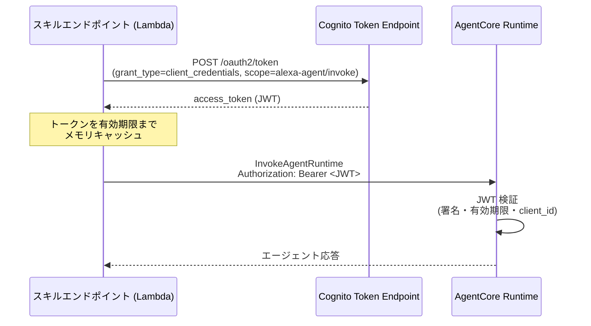

# 認証認可仕様 (AUTH_SPEC)

| 項目 | 内容 |
| --- | --- |
| ステータス | Draft |
| 最終更新日 | 2026-07-13 |
| 関連仕様 | [ARCHITECTURE_SPEC.md](./ARCHITECTURE_SPEC.md), [API_SPEC.md](./API_SPEC.md) |

## 概要

`alexa-agent` の各コンポーネント境界における認証・認可の仕組みを定義する。
AgentCore が提供する認証機構(Inbound Auth の JWT オーソライザ、Outbound Auth の
AgentCore Identity)を採用し、**MVP から JWT/OAuth ベースの構成**で実装する。

## 背景・目的

- AgentCore Runtime のエンドポイントを保護し、正当なスキルエンドポイント(Lambda)
  以外から呼び出せないようにする
- 将来の Alexa Account Linking(エンドユーザー単位の認可)や外部ツール連携
  (Outbound OAuth)へ、認証基盤を作り直さずに拡張できる土台を MVP 時点で敷く

## 仕様(確定事項)

### 認証境界の全体像

| # | 境界 | 方式 | フェーズ |
| --- | --- | --- | --- |
| 1 | Alexa Platform → Lambda | ASK リクエスト署名検証 + Skill ID 検証 | MVP |
| 2 | Lambda → AgentCore Runtime (Inbound Auth) | OAuth 2.0 `client_credentials` + JWT ベアラートークン(IdP: Amazon Cognito) | MVP |
| 3 | AgentCore → 外部ツール (Outbound Auth) | AgentCore Identity(OAuth 2LO/3LO・API キー管理) | Phase 2 |
| 4 | エンドユーザー識別(Account Linking) | Alexa Account Linking + Cognito | Phase 3 |

### 1. Alexa Platform → Lambda

- ASK SDK(`ask-sdk-core`)標準のリクエスト検証を使用する
  - リクエスト署名の検証(Alexa からのリクエストであることの確認)
  - タイムスタンプ検証
- **Skill ID 検証**を必ず有効化し、自スキル以外からの呼び出しを拒否する
- Lambda 関数は Alexa トリガー(Skill ID 条件付きのリソースベースポリシー)以外から
  Invoke できないよう IAM で制限する

### 2. Lambda → AgentCore Runtime(Inbound Auth)

AgentCore Runtime の **JWT オーソライザ(`customJWTAuthorizer`)** を使用する。
IdP は **Amazon Cognito User Pool** とし、M2M(machine-to-machine)構成を取る。

#### Cognito 側の構成

| リソース | 設定 |
| --- | --- |
| User Pool | 認証基盤(MVP ではユーザーは登録しない。M2M 専用) |
| Resource Server | identifier: `alexa-agent`、カスタムスコープ: `alexa-agent/invoke` |
| App Client(M2M 用) | `client_credentials` グラント有効、クライアントシークレット発行、許可スコープ: `alexa-agent/invoke` |

#### AgentCore Runtime 側の構成

```json
{
  "authorizerConfiguration": {
    "customJWTAuthorizer": {
      "discoveryUrl": "https://cognito-idp.<region>.amazonaws.com/<userPoolId>/.well-known/openid-configuration",
      "allowedClients": ["<m2mAppClientId>"]
    }
  }
}
```

#### トークンフロー



- Lambda は取得したトークンを**有効期限までメモリ上にキャッシュ**し、
  リクエストごとのトークン取得を避ける(レイテンシ対策。8 秒制約に直結)
- Cognito のクライアントシークレットは **AWS Secrets Manager** で管理し、
  Lambda 実行ロールにのみ読み取りを許可する

### 3. AgentCore → 外部ツール(Outbound Auth / Phase 2)

外部 API をツールとして呼び出す際の認証情報管理には **AgentCore Identity** を使用する。

- ワークロードアイデンティティとしてエージェントを登録し、外部サービスの
  OAuth クライアント情報・API キーを AgentCore Identity の資格情報プロバイダで管理する
- 2LO(client_credentials 相当)/ 3LO(ユーザー同意フロー)/ API キーのいずれにも対応
- 詳細は Phase 2 のツール仕様(`TOOLS_SPEC.md` 予定)策定時に具体化する

### 4. エンドユーザー識別(Phase 3 構想)

記憶・パーソナライズ(AgentCore Memory)導入時にエンドユーザー単位の認可が必要になる。

- **Alexa Account Linking** を Cognito User Pool(Authorization Code グラント)と接続する
- Alexa リクエストに含まれる `accessToken` を検証し、Cognito 上のユーザーと紐付ける
- 紐付けたユーザー ID を AgentCore Memory の `actorId` として使用する

## 未確定事項 (Open Questions)

- [ ] トークンキャッシュの実装方式(Lambda ハンドラ外のモジュールスコープ変数で十分か)
- [ ] スコープ設計の粒度(MVP は `invoke` のみで良いか。運用系スコープの要否)
- [ ] シークレットローテーション方針(Secrets Manager の自動ローテーション対象にするか)
- [ ] Account Linking の必須/任意(Phase 3 で、未リンクユーザーにも自由対話を許すか)
- [ ] AgentCore Runtime の JWT 検証で `allowedClients` と `allowedAudience` のどちらを主に使うか(実装時に確認)

## 変更履歴

| 日付 | 変更内容 |
| --- | --- |
| 2026-07-13 | 初版作成 |
