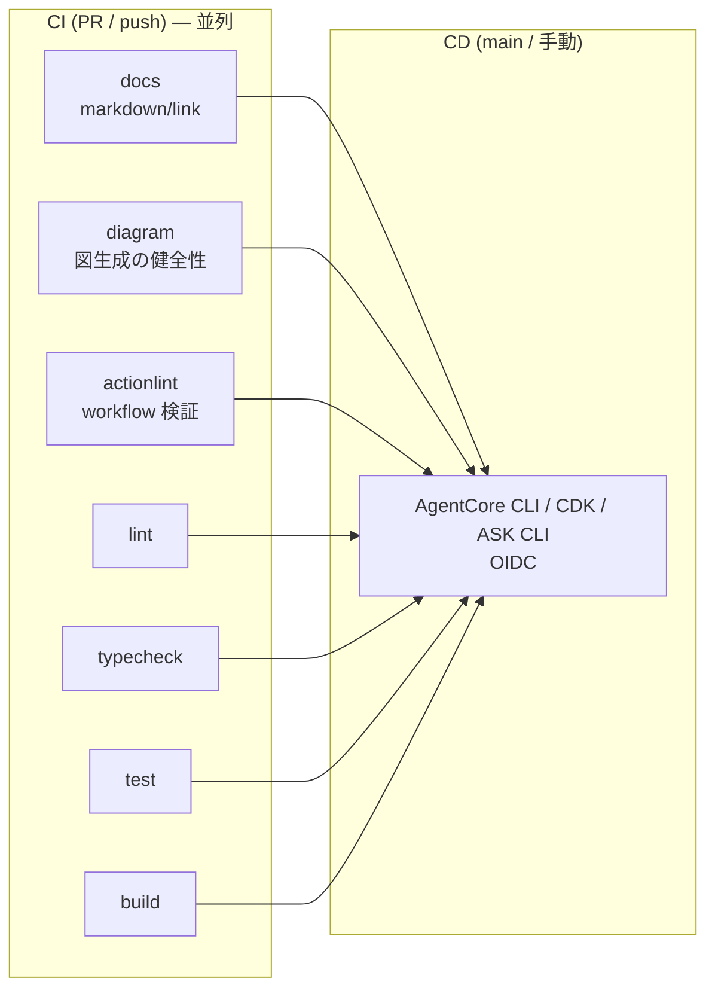

# CI/CD 仕様 (CICD_SPEC)

| 項目 | 内容 |
| --- | --- |
| ステータス | Draft |
| 最終更新日 | 2026-07-14 |
| 関連仕様 | [ARCHITECTURE_SPEC.md](./ARCHITECTURE_SPEC.md), [AGENTCORE_SPEC.md](./AGENTCORE_SPEC.md) |

## 概要

`alexa-agent` の CI/CD パイプラインを定義する。GitHub Actions を用い、**OIDC による
AWS 認証(長期キーレス)**、**並列ジョブによる高速化**、AgentCore CLI・CDK・ASK CLIの
責務分離を前提とする。現時点はアプリコード未実装だが、pnpm/Turborepoの共通品質ゲートを
先行整備し、workspace追加時に同じコマンドへ自動的に参加する構成とする。

## 背景・目的

- 仕様と構成図の整合を CI で継続的に守る(構成図のニアリアルタイム追従、[ARCHITECTURE_SPEC.md](./ARCHITECTURE_SPEC.md))
- アプリ実装が始まったときに lint/typecheck/test/build → deploy の並列パイプラインが即使える土台を用意する
- クレデンシャルを GitHub に置かない(OIDC + 短期 STS)

## 仕様(確定事項)

### パイプライン全体

### CI ジョブ(`.github/workflows/ci.yml`)

すべて**並列実行**。相互依存はない。

| ジョブ | 内容 | 実行条件 |
| --- | --- | --- |
| `docs` | Markdown Lint | 常時 |
| `diagram` | Graphviz/diagrams をセットアップし `docs/diagrams/*.py` を実行、図生成コードが壊れていないことを検証 | 常時 |
| `actionlint` | GitHub Actions ワークフローの静的検証 | 常時 |
| `lint` | pnpm/Turborepo経由のMarkdown・workspace lint | 常時 |
| `typecheck` | pnpm/Turborepo経由の型検査 | 常時 |
| `test` | pnpm/Turborepo経由のユニットテスト | 常時 |
| `build` | pnpm/Turborepo経由のビルド | 常時 |

- Node.jsジョブはpnpm lockfileを使用し、ローカルと同じルートscriptを実行する。
- workspace内の依存関係とキャッシュはTurborepoで管理する。

### CD ジョブ(`.github/workflows/deploy.yml`)

- トリガー: `main` への push(アプリ/インフラ変更時)+ 手動(`workflow_dispatch`)。
- **OIDC 認証**: `permissions: { id-token: write, contents: read }` + `aws-actions/configure-aws-credentials`(`role-to-assume`)。長期アクセスキーは使わない。
- RuntimeはAgentCore CLIの `validate` / `deploy --plan` / `deploy` で管理する。
- Alexa Lambda等の周辺AWS資源は `infra/cdk` からCDK deployする。同一資源をCLIとCDKで二重管理しない。
- Alexaスキルmanifestと対話モデルはASK CLIでvalidate/deployする。
- **ガード**: `AWS_DEPLOY_ROLE_ARN` が設定済みで、かつ `ENABLE_CDK_DEPLOY=true` の場合だけ
  CDKデプロイを実行する。`infra/cdk` 実装前は有効化しない。

### 前提セットアップ(手動・一度きり)

CD を有効化するには以下が必要(未了のため Issue 化):

1. **GitHub OIDC プロバイダ**を AWS アカウントに作成(`token.actions.githubusercontent.com`)。
2. デプロイ用 **IAM ロール**を作成し、信頼ポリシーを当該リポジトリ/ブランチに限定。
3. リポジトリ変数 `AWS_DEPLOY_ROLE_ARN`・`AWS_REGION` を設定。
4. `infra/cdk` 実装後、リポジトリ変数 `ENABLE_CDK_DEPLOY=true` を設定。
5. CDK bootstrap(`cdk bootstrap`)を対象アカウント/リージョンで実施。

### 並列化の方針

- CI の独立ジョブはすべて同時実行(依存を張らない)。
- deploy は全 CI ジョブの成功を `needs` で待ってから実行(品質ゲート)。
- ビルドが重くなったら arm64 セルフホストランナー or CodeBuild への委譲を検討。

## 未確定事項 (Open Questions)

- [ ] arm64 イメージビルドを GitHub ホストランナー(buildx/QEMU)/ arm64 ランナー / CodeBuild のどれで行うか
- [ ] 環境分離(dev/stg/prod)と GitHub Environments・承認フローの設計
- [ ] 構成図の CI を「生成の健全性チェック」から「差分検出(未コミット検出)」に強化するか(PNG レンダリングの非決定性に注意)

## 変更履歴

| 日付 | 変更内容 |
| --- | --- |
| 2026-07-13 | 初版作成 |
| 2026-07-14 | pnpm/TurborepoをCI基盤に採用し、AgentCore CLI・CDK・ASK CLIのデプロイ責務を確定 |
